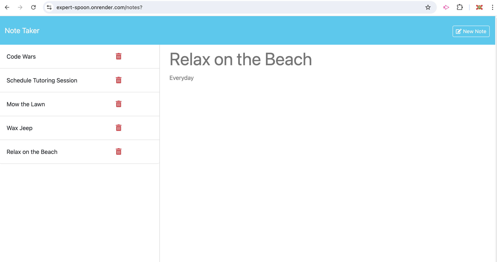

# Note Taker

## Description

A simple task list created with node.js that allows a user to add and delete tasks. The app utilizes express for navigation as well as the backend API and UUID for assigning unique id's to the list items.

Nodemon was installed to speed up development and was only added to the dev-dependencies.

## Installation

```md
npm install
```

## Start Live Server

```md
npm start
```

## Start Dev Server

```md
npm run dev
```

### Deployed URL

- https://expert-spoon.onrender.com

## Screenshot


